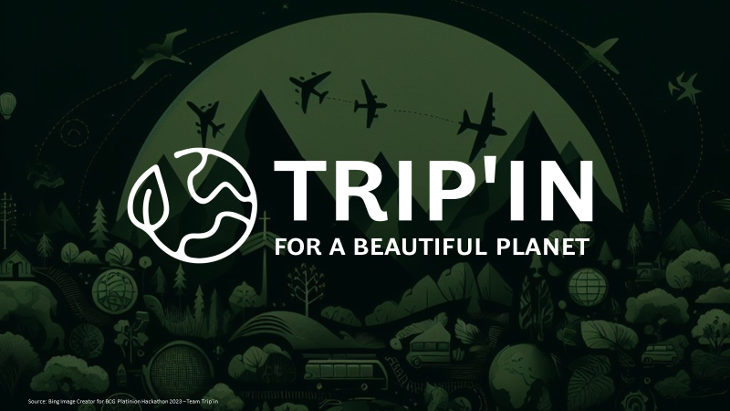
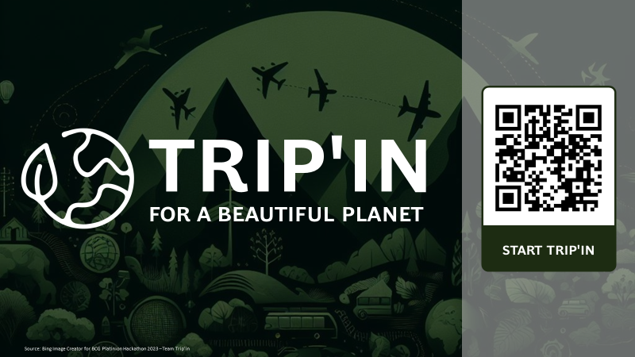

### OUR VISION

"At Trip'in, we envisage a future where travel transcends mere exploration, becoming a conscious, sustainable adventure that leaves a positive imprint on our planet. Our mission is to pioneer a new era of eco-conscious smart travel by harnessing cutting-edge Generative AI technology, revolutionizing the way individuals plan their journeys. We are committed to removing the burden of prompt engineering from end-users, ensuring that sustainable travel is accessible and hassle-free for all.

In our vision, every traveler, whether embarking on a local escapade or a global odyssey, effortlessly accesses our user-friendly platform. With simple interactions, users receive personalized travel recommendations that prioritize eco-friendly choices at every stage of their trip. From selecting eco-conscious transportation options to eco-certified accommodations, and from promoting low-impact activities to suggesting sustainable dining experiences, our AI-powered travel companion empowers users to make informed decisions that minimize their carbon footprint.

Our dedication extends beyond convenience. We aspire to foster a global community of responsible travelers who not only understand their environmental impact but also actively engage in reducing it. Through partnerships with environmental organizations and carbon offset initiatives, Trip'in aims to facilitate travelers in making meaningful contributions to environmental conservation while exploring the wonders of our world.

We believe that by seamlessly blending advanced technology with a steadfast commitment to sustainability, we can redefine the travel industry. Our vision is to inspire a new era of travel—one that respects our planet, nurtures cultural understanding, promotes responsible tourism, and enriches the lives of all who embark on a journey with Trip'in.

In pursuit of this vision, we are dedicated to pushing the boundaries of AI and sustainability, shaping a future where travel transcends boundaries and becomes a catalyst for positive change. Join us on our journey to create a world where travel is not just smart but also truly sustainable, leaving a legacy of environmental responsibility for generations to come."

## Demo

[Video about (winning) team!](https://www.linkedin.com/posts/bcg-platinion_team-tripin-shaping-the-future-of-smart-activity-7133077186881687553-2-Us?utm_source=share&utm_medium=member_desktop)


## STARTING FE & BE ON EC2

# SSH User

Log into the EC2 instance by SSH using belows user and the EC2 .pem certificate

```
ubuntu@3.77.236.93
```

# Build FE

Build the frontend via npm

```
npm run build
```

# Start FE

Start the frontend next.js application in the background on port 3000

```
pm2 start npm --name trippin-app -- run start -- -p 3000
```

# Start BE:

Start up the backend flask application to run in the background on port 80

```
pm2 start app.py --interpreter python3
```

# Display Logs:

Optionally display the FE & BE logs within the SSH session

```
pm2 logs
```

# App Access - TRIP'IN



Access the frontend and start trip'in at the following URL
http://3.77.236.93:3000/

## SCHEMA FOR BE ENDPOINTS

```
/generate-trip
```

Body:

```
{
    starting_position: string,
    activity: string,
    climate: string,
    budget: float,
    time_of_year: string,
    single_trip: bool,
    duration: string,
}
```
